# Diagrammes Mermaid

Ce document contient les diagrammes de classe et de séquence principaux de Personal Assistant, générés avec Mermaid.

## 📋 Table des matières

- [Diagrammes de classe](#diagrammes-de-classe)
- [Diagrammes de séquence](#diagrammes-de-séquence)
- [Diagrammes d'activité](#diagrammes-dactivité)

---

## 🏗️ Diagrammes de classe

### Modèles de domaine principaux

```mermaid
classDiagram
    class User {
        +UUID id
        +String email
        +String hashed_password
        +String name
        +Boolean is_active
        +DateTime created_at
        +DateTime updated_at
        +List~ConfigurableAgent~ configurable_agents
        +List~RefreshToken~ refresh_tokens
    }x

    class Node {
        +UUID id
        +String raw_text
        +String title
        +NodeType type
        +NodeStatus status
        +String domain
        +List~String~ tags
        +String next_action
        +NodeSource source
        +Dict source_ref
        +Dict position
        +Dict ai_meta
        +DateTime created_at
        +DateTime updated_at
    }

    class Edge {
        +UUID id
        +UUID from_node_id
        +UUID to_node_id
        +EdgeRelationType relation_type
        +Float confidence
        +CreatedBy created_by
        +DateTime created_at
    }

    class Trigger {
        +UUID id
        +UUID node_id
        +TriggerType trigger_type
        +Dict config
        +Boolean enabled
        +String last_fired_at
        +String dedupe_key
    }

    class Action {
        +UUID id
        +UUID trigger_id
        +ActionType type
        +Integer order
        +Boolean enabled
        +Dict config
    }

    class ConfigurableAgent {
        +Integer id
        +Integer user_id
        +String name
        +String slug
        +String description
        +String markdown_config
        +String prompt_template
        +JSON output_schema
        +JSON tools
        +JSON mcp_servers
        +String persona
        +String instructions
        +Boolean is_active
        +Boolean is_public
        +DateTime created_at
        +DateTime updated_at
    }

    class AgentExecutionLog {
        +Integer id
        +Integer agent_id
        +Integer user_id
        +String input_text
        +String prompt_used
        +String output_raw
        +JSON output_parsed
        +Boolean success
        +String error_message
        +Integer execution_time_ms
        +DateTime created_at
    }

    class Proposal {
        +UUID id
        +UUID node_id
        +String agent_name
        +JSON proposal_json
        +ProposalStatus status
        +String reviewed_by
        +DateTime reviewed_at
        +DateTime created_at
    }

    class MailCache {
        +UUID id
        +MailProvider provider
        +String provider_message_id
        +String from_addr
        +String subject
        +String snippet
        +DateTime received_at
        +String raw_payload
        +Boolean processed
        +String idempotency_key
    }

    class Event {
        +UUID event_id
        +EventType event_type
        +String idempotency_key
        +JSON payload
        +DateTime created_at
    }

    User "1" --> "*" ConfigurableAgent : owns
    User "1" --> "*" AgentExecutionLog : executes
    Node "1" --> "*" Edge : from_node
    Node "1" --> "*" Edge : to_node
    Node "1" --> "*" Trigger : has
    Trigger "1" --> "*" Action : has
    ConfigurableAgent "1" --> "*" AgentExecutionLog : logs
    Node "1" --> "*" Proposal : has
```

---

### Services et couches applicatives

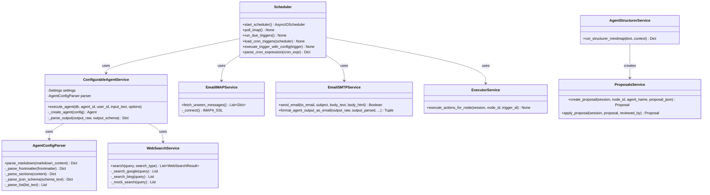

---

### Couche API (Routes)

```mermaid
classDiagram
    class AuthRouter {
        +POST /api/auth/register()
        +POST /api/auth/login()
        +POST /api/auth/refresh()
        +POST /api/auth/logout()
    }

    class NodesRouter {
        +GET /api/nodes()
        +POST /api/nodes()
        +GET /api/nodes/{id}()
        +PUT /api/nodes/{id}()
        +DELETE /api/nodes/{id}()
    }

    class TriggersRouter {
        +GET /api/triggers/node/{node_id}()
        +POST /api/triggers()
        +GET /api/triggers/{id}()
        +PUT /api/triggers/{id}()
        +DELETE /api/triggers/{id}()
        +POST /api/triggers/{id}/execute()
    }

    class ConfigurableAgentsRouter {
        +GET /api/configurable-agents()
        +GET /api/configurable-agents/{id}()
        +POST /api/configurable-agents/{id}/execute()
    }

    class CRUDMindmap {
        +create_node(db, node_data, user_id) Node
        +get_node(db, node_id, user_id) Node
        +update_node(db, node_id, node_data, user_id) Node
        +delete_node(db, node_id, user_id) Boolean
        +create_trigger(db, trigger_data, user_id) Trigger
        +get_triggers_by_node(db, node_id, user_id) List~Trigger~
    }

    AuthRouter --> CRUDMindmap : uses
    NodesRouter --> CRUDMindmap : uses
    TriggersRouter --> CRUDMindmap : uses
    ConfigurableAgentsRouter --> ConfigurableAgentService : uses
    TriggersRouter --> ConfigurableAgentService : uses
    TriggersRouter --> ExecutorService : uses
```

---

## 🔄 Diagrammes de séquence

### Séquence : Exécution manuelle d'un agent IA

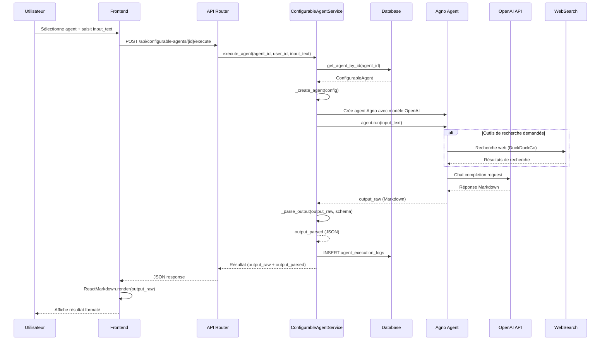

---

### Séquence : Exécution automatique d'un trigger cron

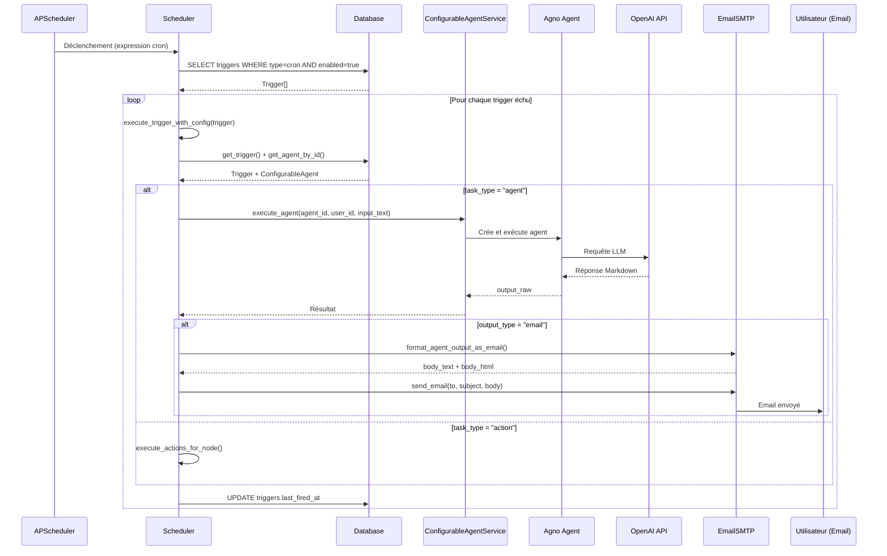

---

### Séquence : Réception et traitement d'un email

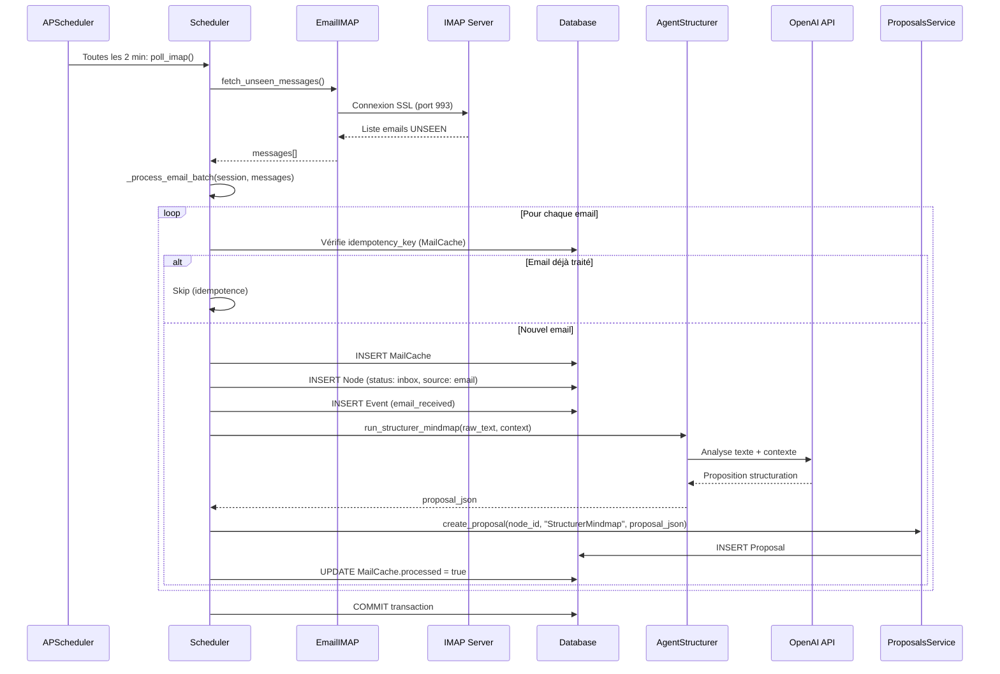

---

### Séquence : Création et validation d'une proposition de structuration

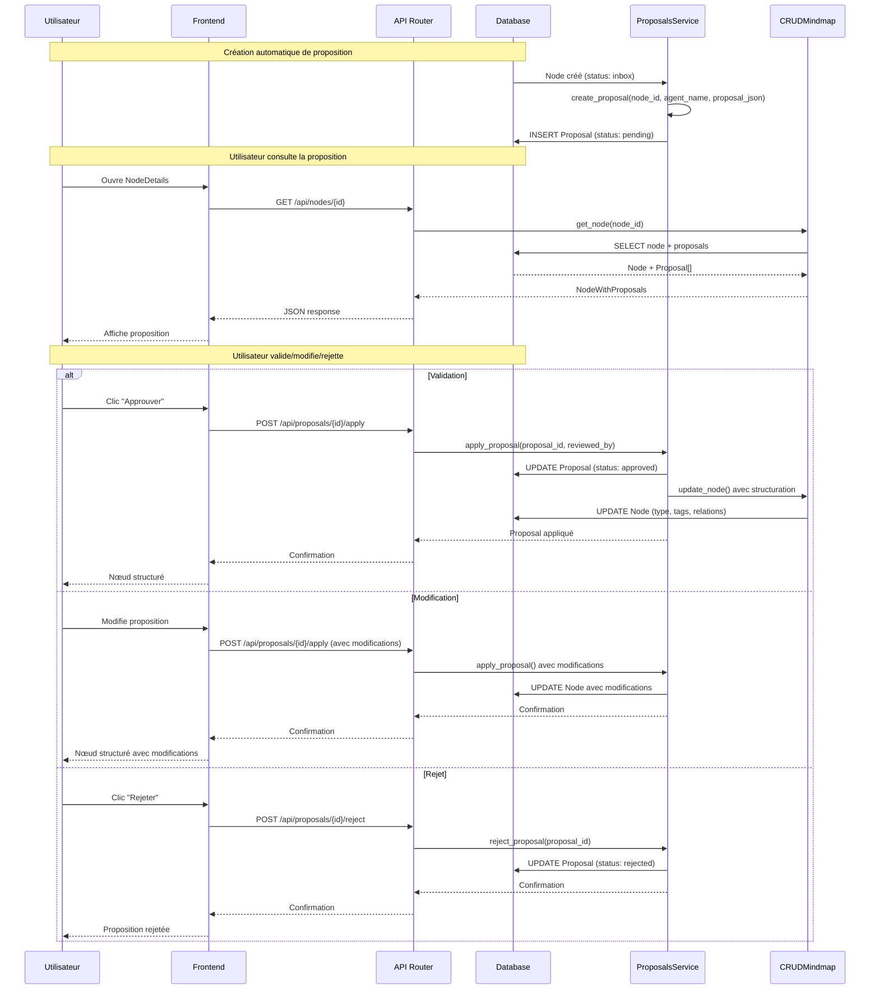

---

### Séquence : Authentification et gestion des tokens

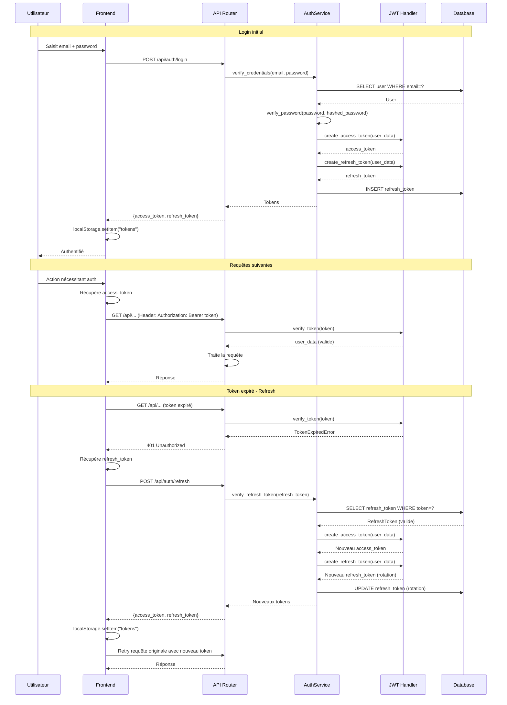

---

### Séquence : Création d'un trigger cron

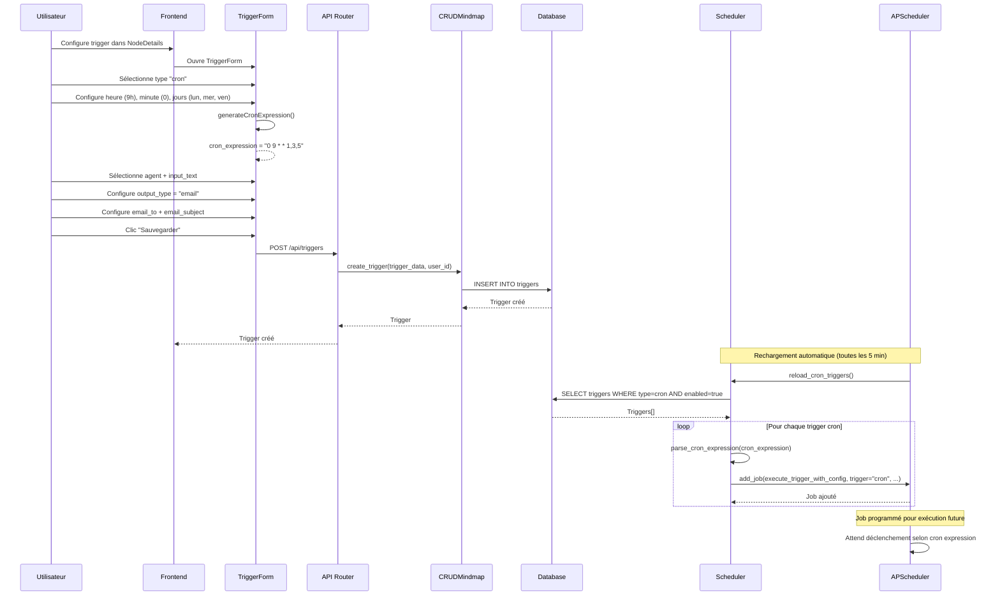

---

## 📊 Diagrammes d'activité

### Activité : Workflow de traitement d'un nœud

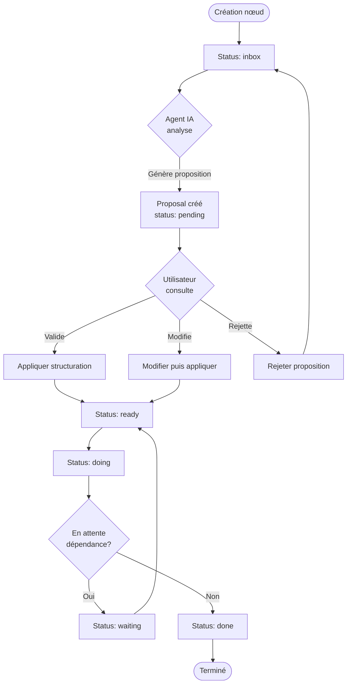

---

### Activité : Cycle de vie d'un trigger

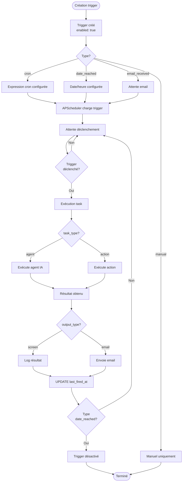

---

## 🔗 Relations entre diagrammes

Ces diagrammes complètent la documentation existante :

- **Diagrammes de classe** : Détails dans [ARCHITECTURE.md](ARCHITECTURE.md#base-de-données)
- **Diagrammes de séquence** : Flux détaillés dans [FLUX_MATRICE.md](FLUX_MATRICE.md#séquences-dexécution)
- **Diagrammes d'activité** : Workflows dans [FUNCTIONAL.md](FUNCTIONAL.md#workflows-métier)

---

## 📝 Utilisation des diagrammes

### Visualisation

Ces diagrammes peuvent être visualisés avec :

1. **Mermaid Live Editor** : [https://mermaid.live/](https://mermaid.live/)
   - Copier-coller le code Mermaid
   - Visualisation interactive

2. **VS Code** : 
   - Extension "Markdown Preview Mermaid Support"
   - Prévisualisation intégrée

3. **GitHub/GitLab** : 
   - Rendu automatique dans les fichiers `.md`
   - Pas d'extension nécessaire

4. **Documentation générée** :
   - Intégration possible avec MkDocs, Docusaurus, etc.
   - Plugins Mermaid disponibles

### Export

Pour exporter en image :

```bash
# Avec Mermaid CLI
npm install -g @mermaid-js/mermaid-cli
mmdc -i diagramme.mmd -o diagramme.png

# Avec Mermaid Live Editor
# Utiliser l'option "Export" dans l'interface
```

---

## 🎨 Diagrammes supplémentaires

### Diagramme de composants Frontend

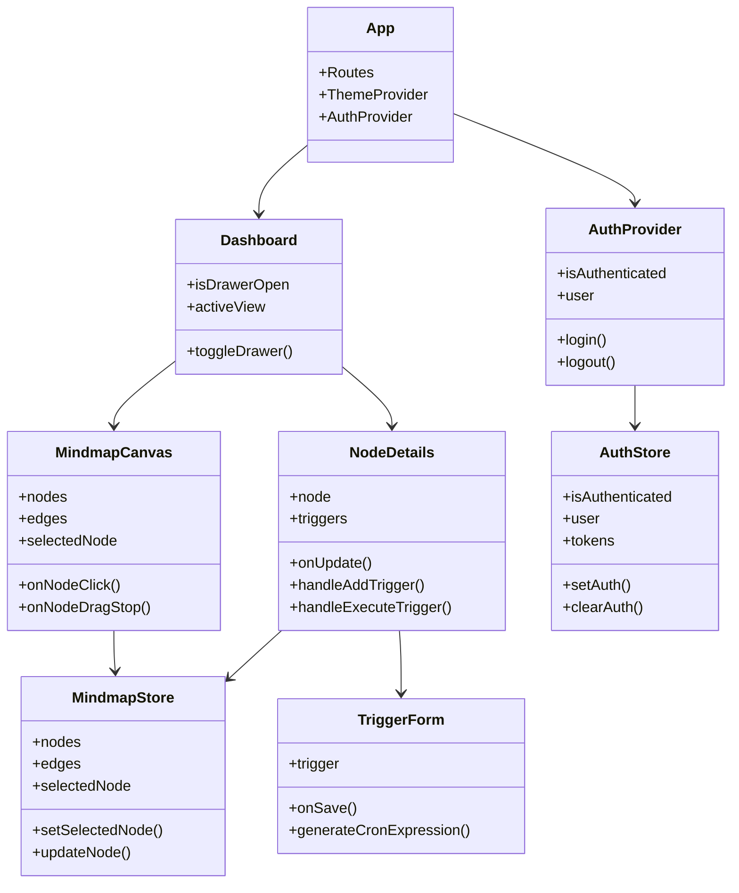

---

### Diagramme d'état : Cycle de vie d'un nœud

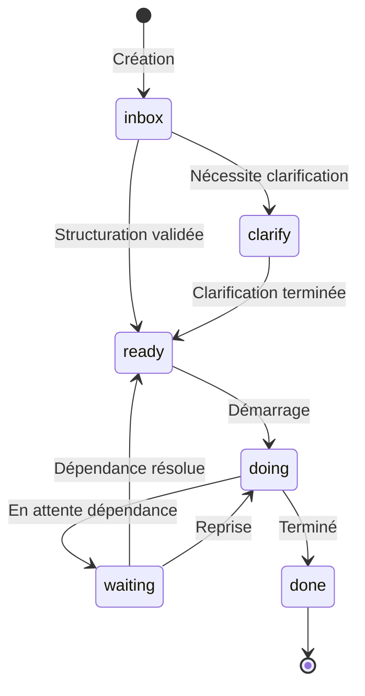

---

### Diagramme d'état : Authentification

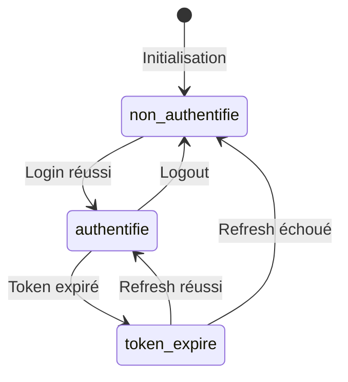

---

**Dernière mise à jour** : 2026-01-22
