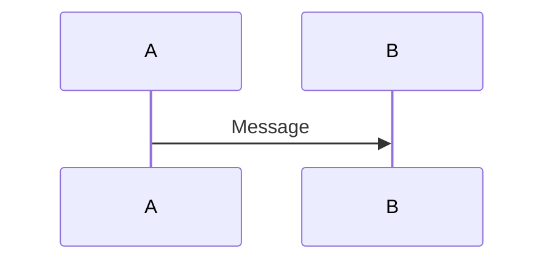

# Configuration Markdown dans Cursor

Ce guide explique comment configurer Cursor pour une meilleure expérience avec les fichiers Markdown, notamment pour visualiser les diagrammes Mermaid.

## 🔌 Extensions recommandées

### Extensions essentielles

1. **Markdown All in One** (`yzhang.markdown-all-in-one`)
   - Prévisualisation Markdown
   - Table des matières automatique
   - Formatage automatique
   - Raccourcis clavier

2. **Markdown Preview Mermaid Support** (`bierner.markdown-mermaid`)
   - **ESSENTIEL** : Rend les diagrammes Mermaid dans la prévisualisation
   - Support complet de la syntaxe Mermaid
   - Export en SVG/PNG

3. **Markdown Preview GitHub Styling** (`bierner.markdown-preview-github-styles`)
   - Style GitHub pour la prévisualisation
   - Meilleure lisibilité

### Extensions optionnelles

4. **Markdown Preview Enhanced** (`shd101wyy.markdown-preview-enhanced`)
   - Prévisualisation avancée
   - Support de nombreux formats (Mermaid, PlantUML, etc.)
   - Export PDF/HTML

5. **markdownlint** (`davidanson.vscode-markdownlint`)
   - Linting des fichiers Markdown
   - Détection d'erreurs de formatage

6. **Markdown Emoji** (`bierner.markdown-emoji`)
   - Support des emojis dans Markdown

## 📦 Installation

### Méthode 1 : Via l'interface Cursor

1. Ouvrir Cursor
2. Aller dans **Extensions** (⌘+Shift+X sur Mac, Ctrl+Shift+X sur Windows/Linux)
3. Rechercher chaque extension par nom
4. Cliquer sur **Install**

### Méthode 2 : Via la commande

```bash
# Installer toutes les extensions recommandées
code --install-extension yzhang.markdown-all-in-one
code --install-extension bierner.markdown-mermaid
code --install-extension bierner.markdown-preview-github-styles
code --install-extension davidanson.vscode-markdownlint
code --install-extension shd101wyy.markdown-preview-enhanced
```

### Méthode 3 : Via le fichier `.vscode/extensions.json`

Le projet contient un fichier `.vscode/extensions.json` avec les extensions recommandées.

1. Ouvrir un fichier Markdown dans Cursor
2. Une notification apparaîtra proposant d'installer les extensions recommandées
3. Cliquer sur **Install All**

## 🎨 Utilisation

### Prévisualisation Markdown

**Raccourcis clavier** :
- **Mac** : `⌘+Shift+V` (prévisualisation) ou `⌘+K V` (prévisualisation côte à côte)
- **Windows/Linux** : `Ctrl+Shift+V` (prévisualisation) ou `Ctrl+K V` (prévisualisation côte à côte)

**Via la commande** :
1. Ouvrir un fichier `.md`
2. Clic droit → **Open Preview**
3. Ou utiliser la palette de commandes (`⌘+Shift+P` / `Ctrl+Shift+P`) → `Markdown: Open Preview`

### Visualisation des diagrammes Mermaid

Une fois **Markdown Preview Mermaid Support** installé :

1. Ouvrir un fichier Markdown contenant des diagrammes Mermaid (ex: `documentation/DIAGRAMMES.md`)
2. Ouvrir la prévisualisation (`⌘+Shift+V`)
3. Les diagrammes Mermaid sont automatiquement rendus

**Exemple** :
```markdown

```

Sera rendu comme un diagramme interactif dans la prévisualisation.

### Table des matières automatique

Avec **Markdown All in One** :

1. Placer le curseur où vous voulez la table des matières
2. Palette de commandes (`⌘+Shift+P`) → `Markdown All in One: Create Table of Contents`
3. La TOC est générée automatiquement

### Formatage automatique

**Raccourci** :
- **Mac** : `⌘+Shift+F`
- **Windows/Linux** : `Ctrl+Shift+F`

Ou automatiquement à la sauvegarde (si activé dans les settings).

## ⚙️ Configuration

Le projet contient un fichier `.vscode/settings.json` avec la configuration recommandée :

- Prévisualisation automatique côte à côte
- Thème sombre pour Mermaid
- Formatage automatique à la sauvegarde
- Word wrap activé pour Markdown

### Personnalisation

Pour modifier les paramètres :

1. Ouvrir les paramètres (`⌘+,` / `Ctrl+,`)
2. Filtrer par "markdown"
3. Ou éditer directement `.vscode/settings.json`

## 🔍 Vérification

Pour vérifier que tout fonctionne :

1. Ouvrir `documentation/DIAGRAMMES.md`
2. Ouvrir la prévisualisation (`⌘+Shift+V`)
3. Vérifier que les diagrammes Mermaid s'affichent correctement

Si les diagrammes ne s'affichent pas :
- Vérifier que `bierner.markdown-mermaid` est installé
- Redémarrer Cursor
- Vérifier la syntaxe Mermaid (doit être dans un bloc ```mermaid)

## 📚 Ressources

- [Documentation Mermaid](https://mermaid.js.org/)
- [Markdown All in One](https://marketplace.visualstudio.com/items?itemName=yzhang.markdown-all-in-one)
- [Markdown Preview Mermaid Support](https://marketplace.visualstudio.com/items?itemName=bierner.markdown-mermaid)

---

**Note** : Ces extensions fonctionnent dans Cursor car il est basé sur VS Code et compatible avec les extensions VS Code.
